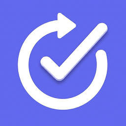
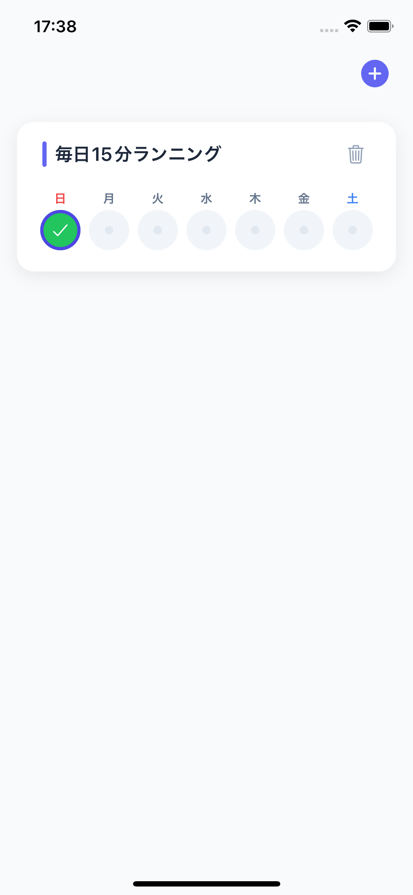
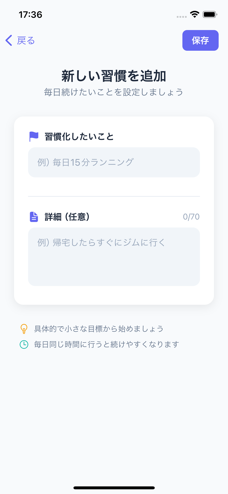
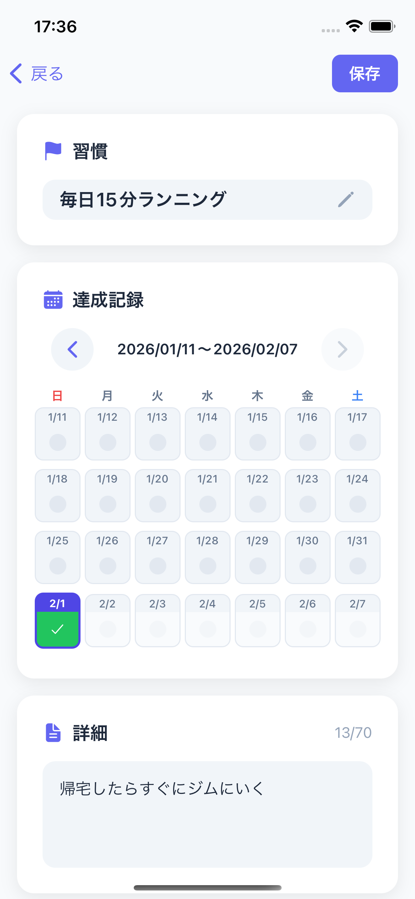
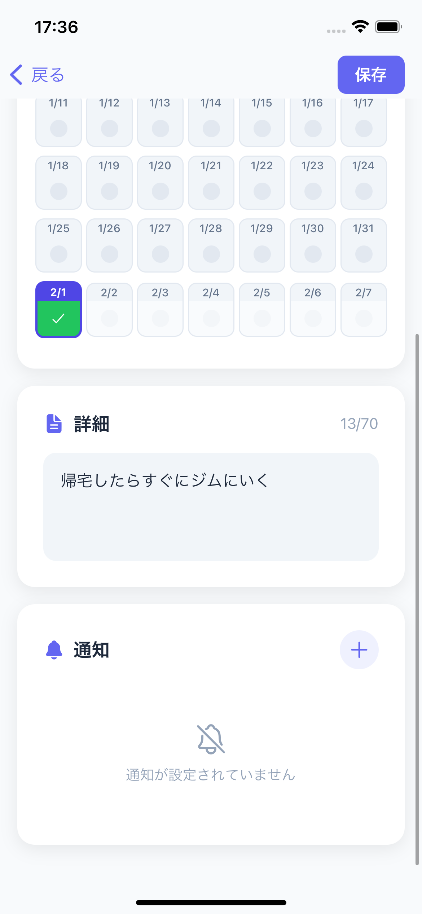
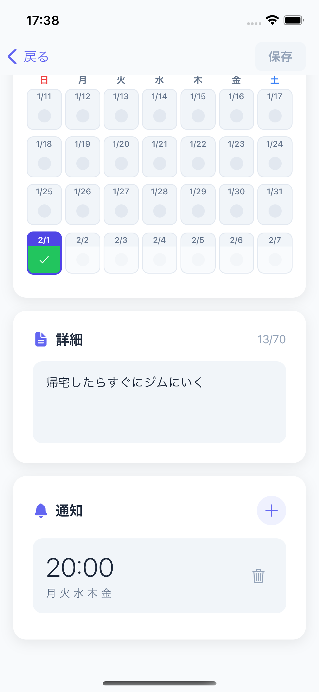
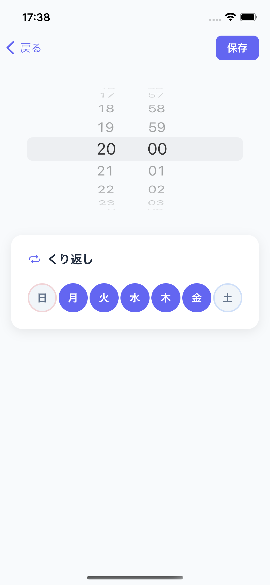

# HabitMaster アプリガイド

<p align="center">
  
</p>

<p align="center">
  <strong>習慣が変われば、人生が変わる。</strong><br>
  シンプルで使いやすい習慣トラッキングアプリ
</p>

---

## 目次

1. [アプリの概要](#アプリの概要)
2. [画面一覧](#画面一覧)
   - [ホーム画面](#1-ホーム画面)
   - [習慣追加画面](#2-習慣追加画面)
   - [習慣編集画面](#3-習慣編集画面)
   - [通知追加画面](#4-通知追加画面)
   - [通知編集画面](#5-通知編集画面)
3. [基本的な使い方](#基本的な使い方)
4. [達成記録の3つの状態](#達成記録の3つの状態)

---

## アプリの概要

HabitMasterは、毎日の習慣化をサポートするシンプルなアプリです。

### こんな方におすすめ

- ダイエットや筋トレを習慣化したい
- 毎日の勉強や読書を続けたい
- 三日坊主をなんとかしたい
- シンプルな記録アプリを探している

### 特徴

- **シンプル**: 余計な機能は一切なし
- **ワンタップ記録**: タップするだけで達成を記録
- **見える化**: 週間・月間で達成状況を確認
- **リマインダー**: 曜日ごとに通知を設定可能
- **多言語対応**: 日本語・英語を切り替え可能

---

## 画面一覧

### 1. ホーム画面

<p align="center">
  
</p>

**この画面でできること:**

| 機能 | 操作方法 |
|------|---------|
| 習慣の一覧表示 | 登録した習慣がカード形式で表示されます |
| 今週の達成状況確認 | 各習慣カードに日〜土の達成状況が表示されます |
| 達成記録 | 各曜日のボタンをタップして達成/未達成を記録 |
| 習慣の追加 | 右上の「+」ボタンをタップ |
| 習慣の編集 | 習慣カードをタップ |
| 習慣の削除 | 習慣カード右側のゴミ箱アイコンをタップ |
| 言語切替 | 右上の地球アイコン（JA/EN）をタップ |

**画面の見方:**

```
┌─────────────────────────────────┐
│                      [JA] [+]  │  ← 言語切替・習慣追加ボタン
├─────────────────────────────────┤
│ ┌─────────────────────────────┐ │
│ │ | 10kg ダイエットする！  [🗑] │ │  ← 習慣名と削除ボタン
│ │                             │ │
│ │  日  月  火  水  木  金  土  │ │  ← 曜日ラベル
│ │  ✓   ✓   ✓   ✗   ✓   ✓   ●  │ │  ← 達成状況
│ └─────────────────────────────┘ │
│                                 │
│ ┌─────────────────────────────┐ │
│ │ | 毎日5ページ本を読む   [🗑] │ │
│ │  日  月  火  水  木  金  土  │ │
│ │  ✓   ✓   ✓   ✓   ✓   ✓   ●  │ │
│ └─────────────────────────────┘ │
└─────────────────────────────────┘

✓ = 達成（緑）
✗ = 未達成（赤）
● = 未記録（グレー）
紫の枠 = 今日
```

---

### 2. 習慣追加画面

<p align="center">
  
</p>

**この画面でできること:**

| 機能 | 説明 |
|------|------|
| 習慣名の入力 | 習慣化したいことを入力（最大14文字） |
| 詳細メモの入力 | 具体的な内容や目標を入力（最大70文字） |
| 保存 | 右上の「保存」ボタンで登録 |

**入力例:**

```
習慣名: 毎日運動する
詳細:  朝起きたら10分間ストレッチをする
```

---

### 3. 習慣編集画面
<p align="center">
  
  
  
</p>

**この画面でできること:**

| 機能 | 操作方法 |
|------|---------|
| 習慣名の編集 | テキストを直接編集 |
| 詳細メモの編集 | テキストを直接編集 |
| 過去の記録確認 | カレンダー形式で過去4週間分を表示 |
| 過去の記録編集 | カレンダーの日付をタップして変更 |
| 期間の切り替え | 「<」「>」ボタンで前後の4週間に移動 |
| 通知の追加 | 「+ 通知を追加」ボタンをタップ |
| 通知の編集 | 既存の通知をタップ |
| 保存 | 右上の「保存」ボタンで変更を反映 |

**カレンダービューの見方:**

```
        2026/01/05〜2026/02/01

    日   月   火   水   木   金   土
   ─────────────────────────────────
    5    6    7    8    9   10   11
    ✓    ✓    ✗    ✓    ●    ✓    ✓
   ─────────────────────────────────
   12   13   14   15   16   17   18
    ✓    ✓    ✓    ✓    ✓    ✓    ✓
   ─────────────────────────────────
    ...（4週間分表示）
```

---

### 4. 通知追加画面

<p align="center">
  
</p>

**この画面でできること:**

| 機能 | 操作方法 |
|------|---------|
| 通知時間の設定 | スピナーで時間を選択 |
| 繰り返し曜日の設定 | 曜日ボタンをタップしてON/OFF |
| 保存 | 右上の「保存」ボタンで登録 |

**繰り返し設定の例:**

```
┌─────────────────────────────────┐
│          07 : 30               │  ← 通知時間
├─────────────────────────────────┤
│  くり返し                       │
│                                 │
│  日   月   火   水   木   金   土 │
│  ○   ●   ●   ●   ●   ●   ○  │
│                                 │
│  ● = ON（通知する）             │
│  ○ = OFF（通知しない）          │
└─────────────────────────────────┘

この設定の場合：月〜金の7:30に通知
```

**曜日ボタンの色:**
- 日曜日: 赤系
- 土曜日: 青系
- 平日: 紫（プライマリカラー）

---

### 5. 通知編集画面

<p align="center">
  
</p>

**この画面でできること:**

| 機能 | 操作方法 |
|------|---------|
| 通知時間の変更 | スピナーで時間を選択 |
| 繰り返し曜日の変更 | 曜日ボタンをタップしてON/OFF |
| 保存 | 右上の「保存」ボタンで変更を反映 |

※ 通知追加画面と同じ操作方法です。

---

## 基本的な使い方

### Step 1: 習慣を追加する

1. ホーム画面の右上「+」をタップ
2. 習慣名を入力（例: 毎日30分読書する）
3. 詳細メモを入力（任意）
4. 「保存」をタップ

### Step 2: 達成を記録する

1. ホーム画面で習慣カードを確認
2. 今日の曜日ボタンをタップ
3. タップするたびに状態が切り替わる
   - 1回目: ✓ 達成
   - 2回目: ✗ 未達成
   - 3回目: 未記録に戻る

### Step 3: 通知を設定する

1. 習慣カードをタップして編集画面へ
2. 「+ 通知を追加」をタップ
3. 通知時間を設定
4. 繰り返す曜日を選択
5. 「保存」をタップ

### Step 4: 過去の記録を振り返る

1. 習慣カードをタップして編集画面へ
2. カレンダーで過去4週間の記録を確認
3. 「<」「>」ボタンでさらに過去を確認
4. 必要に応じて記録を修正
5. 「保存」をタップ

---

## 達成記録の3つの状態

| 状態 | 表示 | 意味 |
|------|------|------|
| 達成 | ✓（緑） | その日の習慣を達成した |
| 未達成 | ✗（赤） | その日の習慣を達成できなかった |
| 未記録 | ●（グレー） | まだ記録していない |

**ポイント:**
- 「未達成」と「未記録」は意味が異なります
- 記録を忘れた日は「未記録」のままでOK
- 意図的にやらなかった日は「未達成」にしましょう

---

## 画面遷移図

```
┌─────────────┐
│  アプリ起動  │
└──────┬──────┘
       │
       ▼
┌─────────────┐     [+]     ┌─────────────┐
│  ホーム画面  │ ──────────▶ │ 習慣追加画面 │
└──────┬──────┘             └─────────────┘
       │
       │ [習慣カードをタップ]
       ▼
┌─────────────┐  [+通知を追加]  ┌─────────────┐
│ 習慣編集画面 │ ─────────────▶ │ 通知追加画面 │
└──────┬──────┘                └─────────────┘
       │
       │ [既存の通知をタップ]
       ▼
┌─────────────┐
│ 通知編集画面 │
└─────────────┘
```

---

## よくある質問

### Q: 達成を記録し忘れた日があります。後から記録できますか？

A: はい、できます。習慣カードをタップして編集画面を開き、カレンダーから該当の日をタップして記録してください。

### Q: 通知が届きません。

A: 以下を確認してください：
1. 端末の設定で通知が許可されているか
2. 通知の繰り返し曜日が正しく設定されているか
3. おやすみモードがOFFになっているか

### Q: 習慣を削除したらデータは戻せますか？

A: いいえ、削除したデータは復元できません。削除時に確認ダイアログが表示されますので、よく確認してから削除してください。

### Q: 言語を切り替えるにはどうすればいいですか？

A: ホーム画面の右上にある地球アイコン（JA/EN）をタップすると、日本語と英語を切り替えられます。設定はアプリを閉じても保持されます。

### Q: アプリの言語は端末の設定に連動しますか？

A: 初回起動時は端末の言語設定に連動します（日本語または英語）。その後は手動で切り替えた言語が優先されます。

---

<p align="center">
  今日から、HabitMasterで新しい習慣を始めましょう。
</p>
